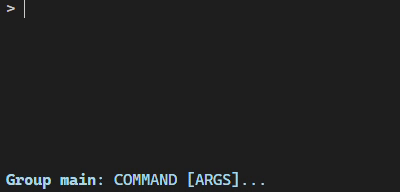
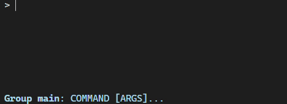
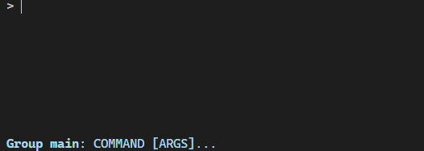

Auto Completion
===============

click-repl uses :class:`~prompt_toolkit.completion.Completer` as its base class to implement its auto-completion
class (:class:`~click_repl.completer.ClickCompleter`), providing suggestions to the REPL prompt.
It uses :class:`~click_repl.completer.ClickCompleter` by default.

It can yield out completions from every click component's ``shell_complete`` (or ``autocompletion`` in version 7) method.
It also does generate auto completion specific to each of click components.

.. admonition:: References

   List of ``shell_complete`` methods in classes within the click module:

   | :meth:`click.Command.shell_complete <click.Command.shell_complete>`
   | :meth:`click.MultiCommand.shell_complete <click.MultiCommand.shell_complete>`
   | :meth:`click.Parameter.shell_complete <click.Parameter.shell_complete>`
   | :meth:`click.ParamType.shell_complete <click.ParamType.shell_complete>`

ReplCompletion
---------------

:class:`~click_repl.completer.ReplCompletion` is implemented using :class:`~prompt_toolkit.completion.Completion` as the base class.
Objects of this type holds the information about possible suggestions for the incomplete text in the REPL prompt.
These objects are submitted from the prompt to appear as suggestions in terminal.

ReplCompletion vs Completion
~~~~~~~~~~~~~~~~~~~~~~~~~~~~

The only difference between :class:`~click_repl.completer.ReplCompletion` and :class:`~prompt_toolkit.completion.Completion`
is that :class:`~click_repl.completer.ReplCompletion` calculates the starting position, relative to the position of text cursor
in the prompt, from where the :attr:`~prompt_toolkit.completion.Completion.text` must inserted, whereas
:class:`~prompt_toolkit.completion.Completion` simply appends the values in the prompt, from the cursor's position.

Usage
~~~~~

click-repl retrieves its suggestions from ``shell_complete`` functions first (``autocompletion`` in click v7).
It prioritizes and yields the suggestions from these functions, other than generating them by their types.

You can use :class:`~click_repl.completer.ReplCompletion` in your custom ``shell_complete`` function.

.. code-block:: python

    import os
    from difflib import get_close_matches

    import click
    from click_repl import repl
    from click_repl.completer import ReplCompletion

    games_list = os.listdir("my/games/directory")

    @click.group(invoke_without_command=True)
    @click.pass_context
    def main(ctx):
        repl(ctx)

    def shell_complete_games_list(ctx, param, incomplete):
        return [
            ReplCompletion(i, incomplete)
            for i in get_close_matches(incomplete, games_list, cutoff=0.5)
        ]

    @main.command()
    @click.argument("name", shell_complete=shell_complete_games_list)
    def get_game(name):
        ...

    main()

However, it will still work if you just return suggestions as plain string.

.. code-block:: python

    def shell_complete_games_list(ctx, param, incomplete):
        return get_close_matches(incomplete, games_list, cutoff=0.5)

    @main.command()
    @click.argument("name", shell_complete=shell_complete_games_list)
    def get_game(name):
        ...

Or as :class:`~click.shell_completion.CompletionItem`

.. code-block:: python

    from click.shell_completion import CompletionItem

    def shell_complete_games_list(ctx, param, incomplete):
        # Displays game titles as in 'title' format as help text, but inserts text as in raw form.
        return [
            CompletionItem(i, help=i.title())
            for i in games_list if i.startswith(incomplete)
        ]

    @main.command()
    @click.argument("name", shell_complete=shell_complete_games_list)
    def get_game(name):
        ...

All these examples work in the similar manner.

It also uses ``shell_complete`` method from :class:`~click.types.ParamType` classes to generate suggestions. Refer to
`Custom Type Completion <https://click.palletsprojects.com/en/8.1.x/shell-completion/#custom-type-completion>`_
from click docs.

Errors during Auto-Completion
~~~~~~~~~~~~~~~~~~~~~~~~~~~~~

Any errors encountered while trying to generate auto-completions are show_hidden_command_and_params in the bottom bar,
using the :meth:`~click_repl.bottom_bar.BottomBar.display_exception` method.

.. code-block:: python

    import click
    from click_repl import register_repl

    @register_repl(remove_command_before_repl=True)
    @click.group(invoke_without_command=True)
    @click.pass_context
    def main(ctx):
        pass

    def mock_error_during_shell_complete(ctx, param, incomplete):
        raise ValueError("mocking error during shell complete")

    @main.command()
    @click.option('--value', shell_complete=mock_error_during_shell_complete)
    def my_command(value):
        print(f'{value = }')

    main()

Custom Completer
----------------

You can make your own completer class. To use it, pass it into the :func:`~click_repl._repl.repl` function's
``completer_cls`` parameter. Passing in the class alone will supply its constructor with necessary values to its parameters.

.. note::

    Make sure to use :class:`click_repl.completer.ClickCompleter` as the base class in order to make your custom completer
    work with the REPL.

    :class:`~click_repl.completer.ClickCompleter` has an abstract method for almost every unique aspect and component
    in the click module. Therefore, it's easy to customize its autocompletion behaviour for every single component.

.. code-block:: python

    import click

    from click_repl import repl
    from click_repl.completer import ClickCompleter

    class MyCompleter(ClickCompleter):
        def get_completions(self, document):
            # Implement your logic on generating suggestions for incomplete text in the prompt.
            ...

    @click.group(invoke_without_command=True)
    @click.pass_context
    def main(ctx):
        repl(ctx, completer_cls=MyCompleter)  # Now, it'll use custom completer.

    main()

Refer to `ClickCompleter's API Docs <click_repl.completer.ClickCompleter>`_ to learn about component-specific methods.

.. note::

    You cannot disable completer in the same way as for the validator. The completer is the crucial component of the click-repl module.

completer_kwargs
----------------

If you want to pass extra keyword arguments to the completer, you can pass it through ``completer_kwargs`` parameter
of :func:`~click_repl._repl.repl` function.

.. code-block:: python

	@click.group(invoke_without_command=True)
	@click.pass_context
	def main(ctx):
		repl(ctx, completer_kwargs={
            # Your extra keyword arguments go here.
            'shortest_option_names_only': True,
            'show_hidden_commands': True
        })

This dictionary of keyword arguments will be updated with the default keyword arguments of the completer, which will be supplied to
the completer while initializing the REPL. The default arguments for :class:`~click_repl.completer.ClickCompleter` are:

#. :attr:`~click_repl.completer.ClickCompleter.group_ctx` - :class:`~click.Context` of the invoked group.
#. :attr:`~click_repl.completer.ClickCompleter.internal_commands_system` - :class:`~click_repl.internal_commands.InternalCommandSystem` object, and
#. :attr:`~click_repl.completer.ClickCompleter.bottom_bar` - :class:`~click_repl.bottom_bar.BottomBar` object of the current REPL session.

These default values are supplied from :meth:`~click_repl._repl.Repl.get_default_completer_kwargs` method.

Suggesting Shortest Option Names Only For Options
-------------------------------------------------

By default, :class:`~click_repl.completer.ClickCompleter` suggests all the option names separately. To suggest only the shortest flag
for each option, set :attr:`~click_repl.completer.ClickCompleter.shortest_option_names_only` to :obj:`True` in the completer's keyword arguments.

The flag :attr:`~click_repl.completer.ClickCompleter.shortest_option_names_only` determines whether only the shortest name of an
option parameter should be used for auto-completion or not. It's :obj:`False` by default.

With this setting, options that have more than one option name will insert only the shortest option name when the suggestion is accepted, but
their suggestions will include all of their names separated by ``/``.

.. code-block:: python

    @click.group(invoke_without_command=True)
    @click.pass_context
    def main(ctx):
        repl(ctx, completer_kwargs={
            'shortest_option_names_only': True
        })

    @main.command()
    @click.option('-u', '--username')
    @click.option('-p', '--port')
    def connect_to_db(username, port):
        ...

Suggesting Hidden Commands and Parameters
-----------------------------------------

By default, :class:`~click_repl.completer.ClickCompleter` won't suggest hidden commands and parameters.

To change this behaviour, use the :attr:`~click_repl.completer.ClickCompleter.show_hidden_commands` flag to include hidden
commands in your suggestions, and use the :attr:`~click_repl.completer.ClickCompleter.show_hidden_params` flag
to include suggestions for hidden parameters. Set both flag to :obj:`True` to display hidden commands and parameters.

These flags determine whether the hidden commands/parameters should be shown in suggestions or not.
They default to :obj:`False`.

However, even if :attr:`~click_repl.completer.ClickCompleter.show_hidden_commands` is :obj:`False`, if the user enters
the whole name of a hidden command, its parmeters will be suggested.

.. code-block:: python

    @click.group(invoke_without_command=True)
    @click.pass_context
    def main(ctx):
        repl(ctx, completer_kwargs={
            'show_hidden_commands': True,
            'show_hidden_params': True
        })

    @main.command()
    @click.option('-u', '--username')
    @click.option('-p', '--port', hidden=True)
    def connect_to_db(username, port):
        ...

    @main.command(hidden=True)
    @click.option('-u', '--username')
    @click.option('-p', '--port')
    def connect_to_admin_db(username, port):
        ...

Suggesting Only Unused Parameters
---------------------------------

By default, click-repl suggests option names even for parameters that have already received values from the prompt.
This allows the user to overwrite and provide a different value even after supplying one.

To prevent the completer from suggesting option names of such parameters, set
:attr:`~click_repl.completer.ClickCompleter.show_only_unused_options` to :obj:`True`. It defaults to :obj:`False`.

This flag determines whether the options that have already been mentioned or used in the current prompt
should be displayed for suggestion or not.

.. code-block:: python

    @click.group(invoke_without_command=True)
    @click.pass_context
    def main(ctx):
        repl(ctx, completer_kwargs={
            'show_only_unused_options': True
        })

    @main.command()
    @click.option('-u', '--username')
    @click.option('-p', '--port')
    def connect_to_db(username, port):
        ...

