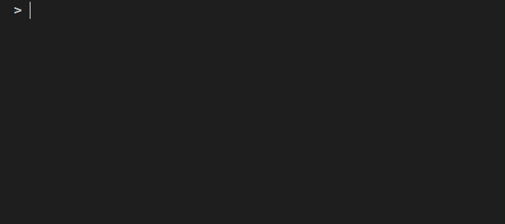

Bottom Bar
==========

click-repl displays a bottom bar using the :class:`~prompt_toolkit.shortcuts.PromptSession`'s
`bottom-toolbar <https://python-prompt-toolkit.readthedocs.io/en/1.0.14/pages/building_prompts.html#adding-a-bottom-toolbar>`_ feature.

It shows the current command, current parameter that require values. It helps to track which parameters still need to
receive values and which do not. It presents the blue print of the current click command/group in a custom format, to show
its current state of usage in the prompt.

The bottom bar displays the command's parameters if any of them haven't received their values.

For parameters, these are the formatting style implemented into bottom bar.

* Parameters that haven't received any values will be displayed as plain text with no special formatting.

* Parameters that are currently receiving values are represented as bold, underlined text.

* Parameters that have received all of its necessary values from the prompt are represented as strikethrough text.

It also keeps track of the values that an :class:`~click.core.Argument` with :attr:`~click.core.Parameter.nargs` > 1 has received.

.. code-block:: python
   :linenos:

   import click
   from click_repl import repl

   @click.group(invoke_without_command=True)
   @click.pass_context
   def main(ctx):
       repl(ctx)

   @main.command()
   @click.option('--student-name')
   @click.argument('marks', nargs=5, type=float)
   def get_marks(student_name, marks):
       print(f'{student_name = }')
       print(f'{marks = }')

   main()

BottomBar
---------

This class generates text that should be displayed at the bottom bar. It returns a
:class:`~click_repl.tokenizer.Marquee` object, which yields the appropriate chunk of text for each iteration to imitate
the behaviour of the `<marquee> <https://developer.mozilla.org/en-US/docs/Web/HTML/Element/marquee>`_ html tag, scrolling the text
left and right in the terminal screen, if it's being overflown from the terminal window.

For more about :class:`~click_repl.tokenizer.Marquee`'s behaviour, Refer to :ref:`marquee_class` docs.

By default, The bottom bar hides the detalis of hidden command and parameters. However, when the whole name of a hidden
command is entered into the REPL, it shows the details about that command. But it still won't show hidden parameters.
To make bottom bar display hidden parameters, set :class:`~click_repl.bottom_bar.BottomBar`'s
:attr:`~click_repl.bottom_bar.BottomBar.show_hidden_params` argument to :obj:`True`.

Don't confuse it with :attr:`~click_repl.completer.ClickCompleter.show_hidden_params`
in :class:`~click_repl.completer.ClickCompleter`.

Custom BottomBar
----------------

The :class:`~click_repl.bottom_bar.BottomBar` has separate methods to render the metadata about each component of
the click command and their parameters. Therefore, it's easy to override some of its default behaviour and use your own
bottom bar implementation. Refer to `BottomBar API docs <click_repl.bottom_bar.BottomBar>`_ to explore those methods.

You can use your own bottom bar class by passing it through ``bottom_toolbar`` key in :class:`~click_repl._repl.repl`'s
``prompt_kwargs`` dictionary. You can send it as an object.

.. code-block:: python
   :linenos:

   import click
   from click_repl import repl
   from click_repl.bottom_bar import BottomBar

   class MyBottomBar(BottomBar):
       # Implement your custom token generation methods.
       ...

   @click.group(invoke_without_command=True)
   @click.pass_context
   def main(ctx):
       repl(ctx, prompt_kwargs={
           "bottom_toolbar": MyBottomBar()
       })

   main()

.. note::

   * The value in ``bottom_toolbar`` should be in a type of
     ":obj:`~prompt_toolkit.formatted_text.AnyFormattedText` | :class:`~click_repl.bottom_bar.BottomBar`".
     The click-repl's :class:`~click_repl.bottom_bar.BottomBar` object supplies updated text via its ``__call__`` method.
     :class:`~prompt_toolkit.shortcuts.PromptSession` will use the bottom bar object's ``__call__`` method
     to get the text that has to be displayed.
