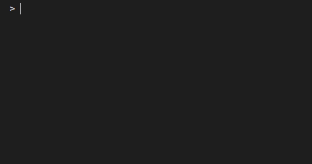

Validator
=========

click-repl uses :class:`~prompt_toolkit.validation.Validator` as its base class to implement its validator
(:class:`~click_repl.validator.ClickValidator`), to validate the user input.
It uses :class:`~click_repl.validator.ClickValidator` by default.

This utility displays the errors that are raised while generating auto-completions, in the form of text in bottom bar
with a red background. It can also verify input text from the prompt while typing.
The prompt will not accept input if the validator reports that it's in an invalid format.

This is particularly useful for dislaying formatted messages from :exc:`~click.exceptions.UsageError` exceptions using its
:meth:`click.exceptions.UsageError.format_message` method.

.. note::

    The validator can only catch and display exceptions that are raised while parsing the prompt. It cannot catch
    errors raised while generating suggestions.

.. code-block:: python

    import click
    from click_repl import repl

    @click.group(invoke_without_command=True)
    @click.pass_context
    def main(ctx):
        repl(ctx)

    @main.command()
    @click.argument('num', type=int)
    def get_number(num):
        print(num)

    main()

Custom Validator
----------------

You can create your own valdiator class. To use it, pass it into the :func:`~click_repl._repl.repl`
function's ``validator_cls`` parameter. Simply passing the class will supply its constructor with
necessary values for its parameters.

.. note::

	Ensure to use :class:`~click_repl.validator.ClickValidator` as the base class to make your custom validtor work with REPL.

.. code-block:: python

    import click

    from click_repl import repl
    from click_repl.validator import ClickValidator

    class MyValidator(ClickValidator):
        def validate(self, document):
            # Implement your logic for validating input text in the prompt.
            ...

    @click.group(invoke_without_command=True)
    @click.pass_context
    def main(ctx):
        repl(ctx, validator_cls=MyValidator)  # Now, it'll use the custom validator.

    main()

You can also disable validation by passing in :obj:`None` to the ``validator_cls`` parameter.

.. code-block:: python

    @click.group(invoke_without_command=True)
    @click.pass_context
    def main(ctx):
        repl(ctx, validator_cls=None)  # No validation is done during typing in prompt.

    main()

This disables the usage of the validator, meaning no validation of input is done while typing in the prompt.

validator_kwargs
----------------

If you want to pass extra keyword arguments to the validator, you can do so through the ``validator_kwargs`` parameter
of :func:`~click_repl._repl.repl` function.

.. code-block:: python

    @click.group(invoke_without_command=True)
    @click.pass_context
    def main(ctx):
        repl(ctx, validator_kwargs={
            # Your extra keyword arguments go here.
            'display_all_errors': False
        })

    main()

This dictionary of keyword arguments will be updated with the default keyword arguments of validator, which will be supplied
to the validator upon initializing the REPL. The default arguments for :class:`~click-repl.validator.ClickValidator` are:

#. :attr:`~click_repl.validator.ClickValidator.group_ctx` - :class:`~click.Context` of the invoked group.
#. :attr:`~click_repl.validator.ClickValidator.internal_commands_system` - :class:`~click_repl.internal_commands.InternalCommandSystem` object of the current REPL session.

These default values are supplied from the :meth:`~click_repl._repl.Repl.get_default_validator_kwargs` method.

Display all Errors
------------------

By default, :class:`~click_repl.validator.ClickValidator` displays all the exceptions, that are raised while parsing the
text in the prompt while typing, in validator bar, including generic python exceptions.

To modify this default behaviour, set the :attr:`~click_repl.validator.ClickValidator.display_all_errors` parameter to
:obj:`False` in the validator kwargs. This flag determines whether to raise generic Python Exceptions
and not to display them in the validator bar, resulting in the full error traceback being
redirected to a log file.

By default it's :obj:`True`, which means all errors raised while typing in prompt are
displayed in the validator bar. If set to :obj:`False`, error tracebacks are displayed during the REPL,
interrupting the prompt. The error traceback and messages are also logged into the ``.click-repl-validator.log`` file.

.. note::

    The :class:`~click_repl.validator.ClickValidator` displays all the exceptions from the click module
    (:exc:`~click.exceptions.ClickException` based exceptions) in the validator bar, by default. This flag has no effect on it.
    It only applies to exceptions that are not a subclass of :exc:`~click.exceptions.ClickException`.

.. code-block:: python

    import click
    from click_repl import repl

    @click.group(invoke_without_command=True)
    @click.pass_context
    def main(ctx):
        repl(ctx, validator_kwargs={
            'display_all_errors': False
        })

    def mock_error_during_shell_complete(ctx, param, incomplete):
        raise ValueError("mocking error during shell complete")

    @main.command()
    @click.argument('num', type=int)
    @click.option('--error', shell_complete=mock_error_during_shell_complete)
    def get_number(num, error):
        print(num)

    main()
