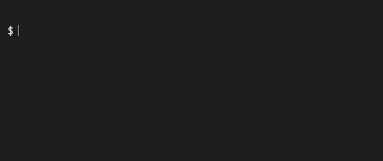

Intoduction
===========

``click-repl`` is an extension for the `click <https://click.palletsprojects.com/en/>`_ module, designed to integrate a REPL
(Read-Eval-Print-Loop) within your click application, by using `python-prompt-toolkit <https://github.com/prompt-toolkit/python-prompt-toolkit>`_
as it's backend. This module allows for seamless interaction with your CLI commands with auto-completion features in your shell environment,
while offering a platform to execute shell commands, without the necessity to tweak your ``.bashrc`` or ``.ps1`` configuration files.

All customizations can be conveniently handled using pure Python code.

Installation
============

Installation is done via pip:

.. code-block:: shell

    pip install click-repl

Usage
=====

Use :func:`~click_repl._repl.register_repl` function to add the :func:`~click_repl._repl.repl` command to your click app's main
group, to your click app. Invoke it from command line to start the repl.

.. code-block:: python

  import click
  from click_repl import register_repl

  @click.group()
  def cli():
      pass

  @cli.command()
  def hello():
      click.echo("Hello world!")

  register_repl(cli)
  cli()

